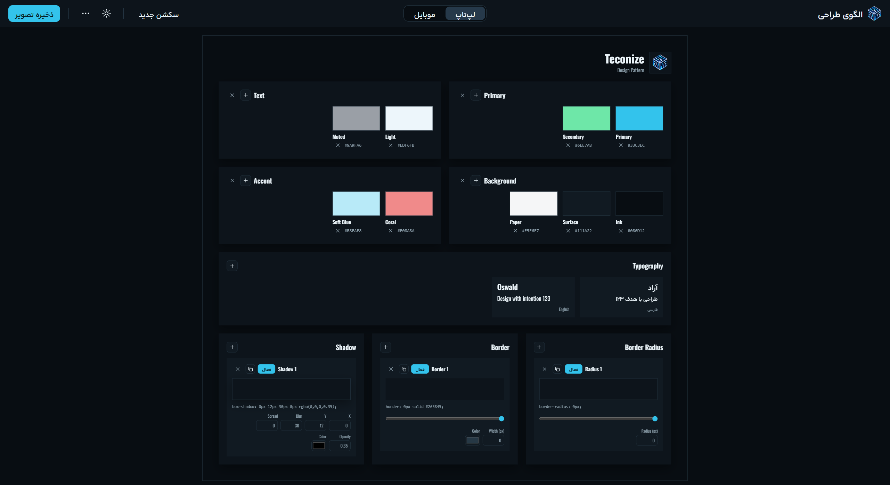

# Pattern Design System

> Design Pattern board by Teconize

A single-file, zero-dependency **design-pattern board** for documenting a brand's design tokens in one place: colors, typography, border radius, borders, and shadows. Edit everything live, then export the board as an image or JSON.

🇮🇷 [نسخهٔ فارسی](#-الگوی-طراحی--teconize)

<p align="center">
  
</p>

## Features

- **Color palettes** — group colors into named sections (Primary, Text, Background, Accent, ...). Pick a color, rename it, or type a HEX value directly.
- **Typography** — ships with Arad (Persian) and Oswald (English) embedded. Upload your own `.woff`, `.woff2`, `.ttf`, or `.otf` font and tag it as Persian, English, or both.
- **Design tokens with live preview**
  - **Border Radius** — slider (0–100 px) + number input (up to 999 px)
  - **Border** — slider (0–20 px) + number input (up to 64 px) + color picker
  - **Shadow** — X, Y, blur, spread, opacity, and color
- **Multiple variants per token** — create several radii / borders / shadows, then press **Apply** to make one the active token for the whole board.
- **Copy CSS** — each token shows its ready-to-paste CSS (`border-radius`, `border`, `box-shadow`) with a one-click copy button.
- **Brand customization** — click the logo or brand name on the board to replace them.
- **Laptop / Phone layouts** — switch the board between a desktop and a mobile view.
- **Light / Dark theme** — follows the system theme by default, with a manual toggle.
- **RTL-first UI** — the interface is Persian (RTL); the board content supports both Persian and English.

## Export & Import

| Action | What it does |
| --- | --- |
| **ذخیره تصویر** (Save image) | Exports the board as a 2× PNG. If the browser blocks PNG export, it falls back to SVG. |
| **ذخیره JSON** (Save JSON) | Downloads the full state (colors, tokens, fonts, brand) as a JSON file. |
| **بارگذاری JSON** (Load JSON) | Restores a previously saved board. |
| **بازنشانی** (Reset) | Resets the board to its defaults. |

Your work is also autosaved in the browser's `localStorage`, so it survives a page refresh.

## Getting Started

No build step, no `npm install`, no server needed.

```bash
git clone https://github.com/farzad-ebrahimi/Pattern-Design-System.git
cd Pattern-Design-System
```

Then open `design-pattern.html` in any modern browser.

### Host it on GitHub Pages (optional)

1. Rename `design-pattern.html` to `index.html`.
2. In your repo go to **Settings → Pages**.
3. Choose your branch and the `/ (root)` folder, then save.

## Tech Notes

- Plain **HTML + CSS + vanilla JavaScript** in a single file. No frameworks and no external requests.
- Fonts and the default logo are embedded as base64, so the file works fully offline.
- Colors and tokens are applied through CSS custom properties (`--rad`, `--bw`, `--bc`, `--sd`) on the board element.
- Image export serializes the board into an SVG `foreignObject`, then draws it to a canvas to produce the PNG.
- State is stored under the `teconize-pattern-v3` key in `localStorage`.

## Browser Support

Any modern evergreen browser (Chrome, Edge, Firefox, Safari). Fonts that you upload are stored inside the saved state as base64, so a large font file can fill the browser's storage quota. If that happens the app warns you and you can use **Save JSON** instead.

## License

Add your license here (for example MIT).

---

# الگوی طراحی — Teconize

یک بوردِ **الگوی طراحی** در قالب یک فایل HTML، بدون هیچ وابستگی، برای مستند کردن توکن‌های طراحی یک برند در یک صفحه: رنگ‌ها، فونت‌ها، بوردر ریدیوس، بوردر و سایه. همه‌چیز را زنده ویرایش کن و خروجی را به‌صورت تصویر یا JSON بگیر.

## امکانات

- **پالت رنگ** — رنگ‌ها را در سکشن‌های نام‌دار (Primary، Text، Background، Accent و ...) دسته‌بندی کن. رنگ را انتخاب کن، اسمش را عوض کن، یا کد HEX را مستقیم بنویس.
- **تایپوگرافی** — فونت‌های آراد (فارسی) و Oswald (انگلیسی) داخل فایل هستند. می‌توانی فونت خودت را با فرمت `.woff`، `.woff2`، `.ttf` یا `.otf` اضافه کنی.
- **توکن‌های طراحی با پیش‌نمایش زنده**
  - **Border Radius** — نوار کم‌وزیاد (۰ تا ۱۰۰ پیکسل) + ورودی عددی
  - **Border** — نوار کم‌وزیاد (۰ تا ۲۰ پیکسل) + ورودی عددی + انتخاب رنگ
  - **Shadow** — مقدارهای X، Y، blur، spread، شفافیت و رنگ
- **چند نسخه برای هر توکن** — چند ریدیوس، بوردر یا سایه بساز و با دکمهٔ «اعمال» یکی را روی کل بوردِ فعال کن.
- **کپی CSS** — کد CSS هر توکن آماده است و با یک کلیک کپی می‌شود.
- **شخصی‌سازی برند** — روی لوگو یا نام برند کلیک کن تا عوضشان کنی.
- **نمای لپ‌تاپ / موبایل** و **تم روشن / تیره**.

## خروجی و ورودی

| عملیات | توضیح |
| --- | --- |
| **ذخیره تصویر** | خروجی PNG با کیفیت ۲ برابر (اگر مرورگر اجازه ندهد، SVG ذخیره می‌شود) |
| **ذخیره JSON** | ذخیرهٔ کل بوردِ (رنگ‌ها، توکن‌ها، فونت‌ها، برند) در یک فایل JSON |
| **بارگذاری JSON** | بازگرداندن بوردِ ذخیره‌شده |
| **بازنشانی** | برگرداندن همه‌چیز به حالت پیش‌فرض |

تغییرات به‌صورت خودکار در `localStorage` مرورگر هم ذخیره می‌شود و با رفرش از بین نمی‌رود.

## اجرا

نیازی به نصب یا سرور نیست. فایل `design-pattern.html` را در مرورگر باز کن.

برای انتشار روی GitHub Pages: نام فایل را به `index.html` تغییر بده، سپس از **Settings → Pages** شاخه و پوشهٔ root را انتخاب کن.

## نکتهٔ فنی

اگر فونت سنگینی آپلود کنی، چون داخل حافظهٔ مرورگر ذخیره می‌شود ممکن است حافظه پر شود. در این حالت برنامه هشدار می‌دهد و می‌توانی از «ذخیره JSON» استفاده کنی.
